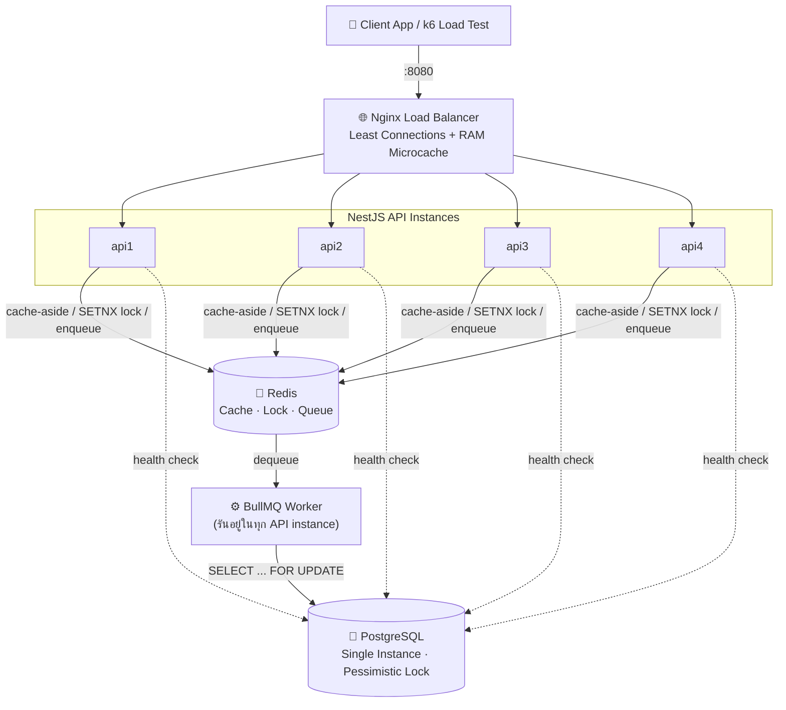
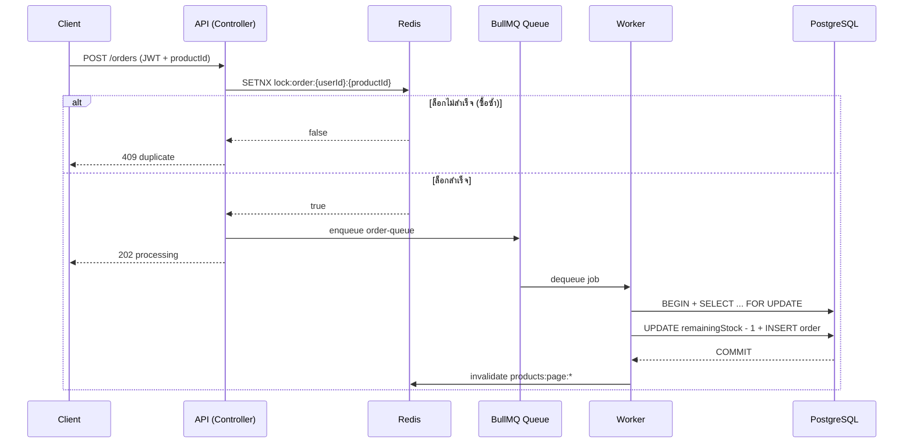

# ⚡ Flash Sale Backend System

**Mobile Backend Architecture & High-Performance Testing**

[](https://nestjs.com/)
[](https://www.typescriptlang.org/)
[](https://www.postgresql.org/)
[](https://redis.io/)
[](https://docs.bullmq.io/)
[](https://www.docker.com/)

ระบบ Backend สำหรับแอปพลิเคชันมือถือในสถานการณ์ **Flash Sale** ออกแบบด้วยสถาปัตยกรรมแบบ
**High Throughput & Low Latency** เพื่อรองรับการยิงคำขอพร้อมกันจำนวนมาก ป้องกันการกดซื้อซ้ำซ้อน
และการันตีว่าสต็อกสินค้าไม่มีทางติดลบ (**Zero Overbooking**)

---

## 📑 สารบัญ (Table of Contents)

1. [ภาพรวมสถาปัตยกรรมระบบ](#1-ภาพรวมสถาปัตยกรรมระบบ-architecture-overview)
2. [โครงสร้างโปรเจกต์](#2-โครงสร้างโปรเจกต์-project-structure)
3. [เริ่มต้นใช้งาน](#3-เริ่มต้นใช้งาน-getting-started)
4. [API Endpoints](#4-api-endpoints)
5. [กลไกป้องกัน Race Condition](#5-กลไกป้องกัน-race-condition-concurrency-defense)
6. [การทดสอบระบบ](#6-การทดสอบระบบ-testing-and-verification)
7. [Troubleshooting](#7-troubleshooting)
8. [Observability](#8-observability-bull-board-dashboard)
9. [Redis Key Convention](#9-redis-key-convention)
10. [Tech Stack](#10-tech-stack)
11. [Contributors](#11-contributors)

---

## 📐 1. ภาพรวมสถาปัตยกรรมระบบ (Architecture Overview)



> **หมายเหตุ:** ไม่มี DB Replication (Master/Replica) — ใช้ Postgres instance เดียว เพราะ read
> replica lag จะทำให้ `remainingStock` ที่ตอบกลับไม่ตรงความจริง ซึ่งขัดกับข้อกำหนดเรื่องความถูกต้อง
> ของสต็อกโดยตรง Bull-Board Dashboard เปิดดูได้ที่ `http://localhost:8080/admin/queues`

### 🌟 ฟีเจอร์สำคัญในระบบ

| # | ฟีเจอร์ | รายละเอียด |
|---|---|---|
| 1 | **Load Balancing (Nginx)** | กระจายคำขอไปยัง 4 Backend Instances แบบ Least Connections พร้อม RAM Microcache (`/dev/shm`) สำหรับ `GET /products` |
| 2 | **Stateless Authentication (JWT)** | ยืนยันตัวตนด้วย JSON Web Token ล้วน ไม่มี session บนตัว instance |
| 3 | **Read-Heavy Caching (Redis Cache-Aside)** | แคชรายการสินค้า พร้อม Cache Invalidation ทันทีเมื่อสต็อกอัปเดต |
| 4 | **API-Level Concurrency Locking** | ล็อกสิทธิ์ด้วย Redis Atomic Operation (`SETNX`) ป้องกันผู้ใช้คนเดิมกดซื้อซ้ำซ้อน |
| 5 | **Asynchronous Order Queue (BullMQ)** | ส่งคำสั่งซื้อเข้า Message Queue ตอบกลับ `202 Accepted` ทันทีภายในมิลลิวินาที |
| 6 | **Worker DB Stock Deduction** | Worker ตัดสต็อกด้วย **Pessimistic Write Locking** (`SELECT ... FOR UPDATE`) การันตีสต็อกห้ามติดลบ |

---

## 📂 2. โครงสร้างโปรเจกต์ (Project Structure)

```text
FlashSaleBackend/
├── src/
│   ├── auth/               # JWT Authentication (POST /api/v1/auth/token)
│   ├── products/           # จัดการและแคชสินค้า (GET /api/v1/products)
│   ├── orders/             # Controller + Service สั่งซื้อ (POST /api/v1/orders — ไม่เขียน DB ตรง)
│   ├── worker/             # BullMQ Worker ตัดสต็อก (order.processor.ts)
│   ├── entities/           # Product / Order TypeORM entities
│   ├── common/             # Redis provider, JWT guard, exception filter ที่ใช้ร่วมกัน
│   ├── migrations/         # TypeORM migrations (แหล่ง schema จริง)
│   ├── app.module.ts
│   └── main.ts             # setGlobalPrefix('api/v1') + เปิด Bull-Board
├── db/
│   └── init.sql            # สำเนา SQL อ้างอิง (ต้นแบบจริงคือ src/migrations/)
├── loadtest/
│   ├── loadtest.js         # k6 Load Test Script
│   ├── test-demo.js        # ชุดทดสอบ/chaos suite แบบ interactive
│   └── verify.js           # ตรวจผลลัพธ์จริงใน DB (stock / order count)
├── docs/
│   └── CONTRACT.md         # สัญญา API & Redis Key ระหว่างสมาชิกในทีม
├── docker-compose.yml      # Nginx + 4 API Instances + PostgreSQL + Redis
├── nginx.conf              # ค่าคอนฟิก Nginx Load Balancer
└── package.json
```

---

## 🚀 3. เริ่มต้นใช้งาน (Getting Started)

```bash
git clone <repository_url>
cd FlashSaleBackend
```

### วิธีที่ 1: รันทั้งระบบด้วย Docker Compose (แนะนำ)

```bash
docker compose up -d --build
```

Docker Compose จะไล่ทำตามลำดับให้อัตโนมัติผ่าน `healthcheck` + `depends_on`:

1. `postgres` / `redis` บูตขึ้นจนพร้อมรับ connection (`healthcheck`)
2. service `migrate` (one-off) รัน TypeORM migration สร้าง schema + seed สินค้า 20 รายการ
3. `api1`–`api4` เริ่มบูตและรอจน `/api/v1/health` ตอบ 200 จริง
4. `nginx` เริ่มทำงานหลังจาก API ทั้ง 4 ตัว healthy ครบ

ตรวจสถานะ:

```bash
docker compose ps   # ทุกตัวต้องขึ้น Up (healthy) ยกเว้น migrate ที่ควรเป็น Exited (0)
```

> ℹ️ Schema ทั้งหมดมาจากทางเดียวคือ TypeORM migration (`src/migrations/`) — ไม่ได้พึ่ง Postgres
> auto-init script เพื่อความเสถียรของ schema ระหว่าง instance

### วิธีที่ 2: รันเฉพาะฐานข้อมูล แล้วรัน NestJS บนเครื่อง (Development Mode)

```bash
npm install                       # 1. ติดตั้ง dependencies
docker compose up -d postgres redis   # 2. เปิดเฉพาะ Postgres + Redis
npm run migration:run             # 3. รัน migration
npm run start:dev                 # 4. รัน NestJS แบบ watch mode (port 3000)
```

---

## 🔌 4. API Endpoints

Prefix หลักของทุก API คือ **`/api/v1`**

### 4.1 `POST /api/v1/auth/token` — ขอ JWT Token

```powershell
$token = (Invoke-RestMethod -Uri "http://localhost:8080/api/v1/auth/token" -Method Post -ContentType "application/json" -Body '{"userId": "user-001"}').accessToken
```

```json
{ "status": "success", "accessToken": "eyJhbGciOiJIUzI1NiIsInR..." }
```

### 4.2 `GET /api/v1/products?page=1&limit=10` — รายการสินค้า (Cache-Aside)

```powershell
Invoke-RestMethod -Uri "http://localhost:8080/api/v1/products?page=1&limit=5" -Method Get | ConvertTo-Json -Depth 3
```

```json
{
  "status": "success",
  "data": [
    {
      "productId": "p-1001",
      "name": "Limited Edition Sneaker",
      "price": 2990,
      "availableStock": 50,
      "remainingStock": 50,
      "isFlashSaleActive": true
    }
  ],
  "meta": { "total": 20, "page": 1, "limit": 5, "totalPages": 4 }
}
```

### 4.3 `POST /api/v1/orders` — สั่งซื้อสินค้า Flash Sale (Asynchronous)

Header: `Authorization: Bearer <accessToken>`

```powershell
Invoke-RestMethod -Uri "http://localhost:8080/api/v1/orders" -Method Post -Headers @{ "Authorization" = "Bearer $token" } -ContentType "application/json" -Body '{"productId": "p-1001"}' | ConvertTo-Json
```

```json
{ "status": "processing", "orderJobId": "job-1", "message": "Your order is in the queue." }
```

| กรณี | HTTP | `status` |
|---|---|---|
| ไม่มี / JWT ไม่ถูกต้อง | 401 | `error` |
| user คนเดิมกดซ้ำสินค้าเดิม | 409 | `duplicate` |
| ไม่มี `productId` นี้ | 404 | `error` |

*(หากรันแบบ Local Dev Mode ให้เปลี่ยน `http://localhost:8080` เป็น `http://localhost:3000`)*

---

## 🛡️ 5. กลไกป้องกัน Race Condition (Concurrency Defense)

ระบบป้องกันการซื้อซ้ำซ้อนและสต็อกติดลบด้วย **3 ชั้นป้องกัน** ทำงานร่วมกัน — ตัดชั้นไหนออกไม่ได้ทั้งนั้น:

| ชั้น | กลไก | ทำงานที่ไหน |
|---|---|---|
| 1️⃣ API | `SET lock:order:{userId}:{productId} NX EX 60` (Redis atomic) — ล็อกไม่ได้ → ตอบ `409` ทันที | Controller/Service ก่อน enqueue |
| 2️⃣ Worker | Transaction + `SELECT ... FOR UPDATE` (Pessimistic Lock) ก่อนตัดสต็อก | `order.processor.ts` |
| 3️⃣ Database | `UNIQUE(user_id, product_id)` + `CHECK(remaining_stock >= 0)` | Schema constraint |

**Flow การสั่งซื้อ:**



เมื่อ Worker commit สำเร็จ ต้อง invalidate cache key `products:page:*` ทุกครั้ง ไม่งั้น `GET /products`
จะยังโชว์สต็อกเก่าอยู่

---

## 🧪 6. การทดสอบระบบ (Testing and Verification)

### 6.1 รีเซ็ต State ก่อนเริ่มยิงเทสต์รอบใหม่

ล้างสต็อกสินค้ากลับเต็ม + ลบ orders ทั้งหมด + flush Redis ก่อนเริ่มรอบทดสอบใหม่แต่ละครั้ง
(จำเป็นเมื่อต้องยิงซ้ำหลายรอบ เพราะข้อมูล order เดิมยังอยู่ถาวรใน Postgres):

```bash
npm run loadtest:reset
```

ปรับปลายทางได้ผ่าน env var (`.env` หรือ inline) ถ้า DB/Redis ไม่ได้อยู่ที่ `localhost`:

```bash
DB_HOST=<SERVER_IP> REDIS_HOST=<SERVER_IP> node loadtest/reset-state.js
```

### 6.2 Chaos / Interactive Test Suite

เมนูให้เลือกทดสอบทีละสถานการณ์ (spam attack, overbooking, edge cases ฯลฯ) หรือรันครบทุกเคสรวดเดียว:

```bash
node loadtest/test-demo.js
```

### 6.3 k6 Load Test

เตรียม JWT 500 users → GET 1,000 concurrent → POST 500 concurrent แย่งกันกดสั่งซื้อสินค้า `p-1001`:

```bash
# ถ้ามี k6 ติดตั้งในเครื่องแล้ว
k6 run loadtest/loadtest.js
```

```powershell
# ถ้าไม่มี k6 ในเครื่อง — ใช้ Docker แทน (ยิงข้ามเครื่องได้ด้วย)
Get-Content .\loadtest\loadtest.js | docker run --rm -i grafana/k6 run -e BASE_URL=http://<SERVER_IP>:8080/api/v1 -
```

### 6.4 ตรวจผลลัพธ์จริงในฐานข้อมูล

```bash
node loadtest/verify.js
```

หรือตรวจตรงใน Postgres (คอลัมน์เป็น camelCase ต้องใส่ `"..."` ครอบชื่อ):

```bash
docker compose exec postgres psql -U myuser -d flash_sale_db -c "
  SELECT \"remainingStock\" FROM products WHERE \"productId\"='p-1001';
  SELECT COUNT(*) AS total_orders, COUNT(DISTINCT \"userId\") AS unique_users, MAX(cnt) AS max_per_user
  FROM (SELECT \"userId\", COUNT(*) cnt FROM orders WHERE \"productId\"='p-1001' GROUP BY \"userId\") t;
"
```

**เกณฑ์ผ่าน:** `remainingStock = 0` พอดี, `total_orders = 50`, `unique_users = 50`, `max_per_user = 1`

---

## 🩺 7. Troubleshooting

| ปัญหา | สาเหตุ / วิธีแก้ |
|---|---|
| Write p95 สูงผิดปกติ ทั้งที่เคยผ่านมาก่อน | เช็กว่ามี process อื่นแย่ง CPU อยู่หรือไม่ (`uptime`, `top -bn1 -o %CPU`) โดยเฉพาะ debug tool ที่ค้างจาก remote session — kill ทิ้งได้ถ้าไม่ใช่ container ของแอป |
| Read p95 สูงผิดปกติทั้งที่มี Nginx cache แล้ว | เช็กว่า `nginx.conf` ยังตั้ง `worker_processes 2;` อยู่ (ห้ามใช้ `auto` ถ้า deploy บนเครื่องที่ถูกจำกัด CPU quota ด้วย cgroup เพราะ `nproc` ในคอนเทนเนอร์จะเห็น core ของโฮสต์ทั้งหมด ทำให้ spawn worker เกินจำเป็น) เช็กด้วย `docker compose exec nginx sh -c "ps aux | grep 'nginx: worker' | wc -l"` |
| กลุ่มอื่นยิงต่อจากกลุ่มเราแล้วได้ `202` แต่ Worker reject เงียบๆ | ยังไม่ได้รีเซ็ต state ของ user ชุดเดิม (ดู [6.1](#6-การทดสอบระบบ-testing-and-verification)) — order เดิมยังอยู่ถาวรใน Postgres ทำให้ unique constraint ชนแบบเข้าใจผิดว่าเป็นบั๊ก |

---

## 📊 8. Observability (Bull-Board Dashboard)

เปิดดูสถานะการทำงานของคิว (Jobs in Queue, Active, Completed, Failed) ได้ผ่านหน้าเว็บ:

👉 **http://localhost:8080/admin/queues** (หรือ `http://localhost:3000/admin/queues` ในโหมด dev)

---

## 🔑 9. Redis Key Convention

| Key Pattern | ใช้ทำอะไร |
|---|---|
| `products:page:{page}:limit:{limit}` | Cache ผลลัพธ์ `GET /products` (TTL 30s) |
| `cache:stats:hit` / `cache:stats:miss` | Counter สำหรับ Dashboard |
| `lock:order:{userId}:{productId}` | `SET ... NX EX 60` กันกดรัวๆ ระดับ API |
| `bull:order-queue:*` | จัดการโดย BullMQ อัตโนมัติ |

คิวชื่อ `order-queue` · `jobId = {userId}:{productId}` (BullMQ กันงานซ้ำให้อีกชั้นอัตโนมัติ) ·
Job options: `attempts: 3`, `backoff: exponential 200ms`, `removeOnComplete/Fail: 500`

---

## 🧰 10. Tech Stack

| Layer | Technology |
|---|---|
| Framework | [NestJS](https://nestjs.com/) 11 (TypeScript) |
| Load Balancer | Nginx (Least Connections + Microcache) |
| Database | PostgreSQL + [TypeORM](https://typeorm.io/) |
| Cache / Lock / Queue Store | Redis ([ioredis](https://github.com/redis/ioredis)) |
| Job Queue | [BullMQ](https://docs.bullmq.io/) + Bull-Board |
| Auth | JWT ([@nestjs/jwt](https://github.com/nestjs/jwt)) |
| Logging | nestjs-pino |
| Containerization | Docker Compose |
| Load Testing | [k6](https://k6.io/) |

---

## 👥 11. Contributors

โปรเจกต์วิชา Mobile Backend Architecture & Performance Testing — งานกลุ่ม 3 คน

| GitHub |
|---|
| [@LAKZTV](https://github.com/LAKZTV) |
| [@LomerAlloys](https://github.com/LomerAlloys) |
| [@PiriPiri11](https://github.com/PiriPiri11) |

รายละเอียดสัญญา API และการแบ่งงานเพิ่มเติมดูได้ที่ [`docs/CONTRACT.md`](docs/CONTRACT.md)
